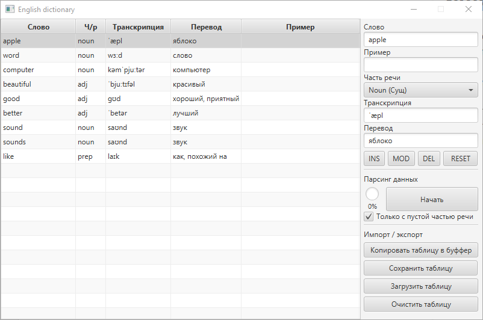

# Simple english dictionary

This is a very simple english-to-russian dictionary, 
written in Java using JavaFX for UI and JSoup for data parsing.

### Features:
- Parsing part of speech, russian translation and transcription from [Cambridge Dictionary](https://dictionary.cambridge.org)
- Importing and exporting table data (tsv)
- Copying tsv table into clipboard

